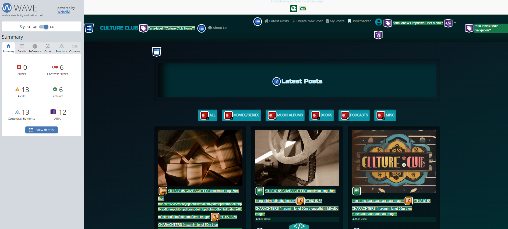
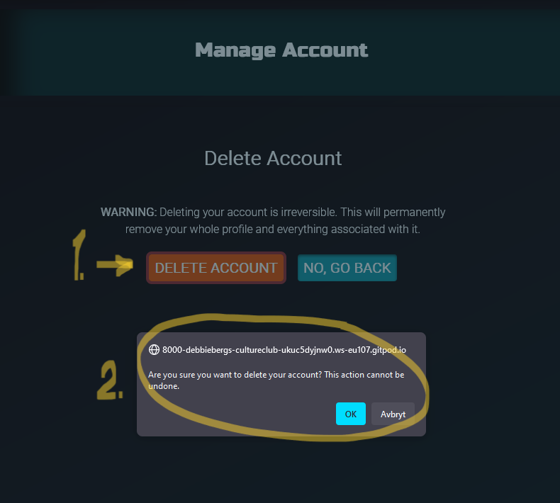
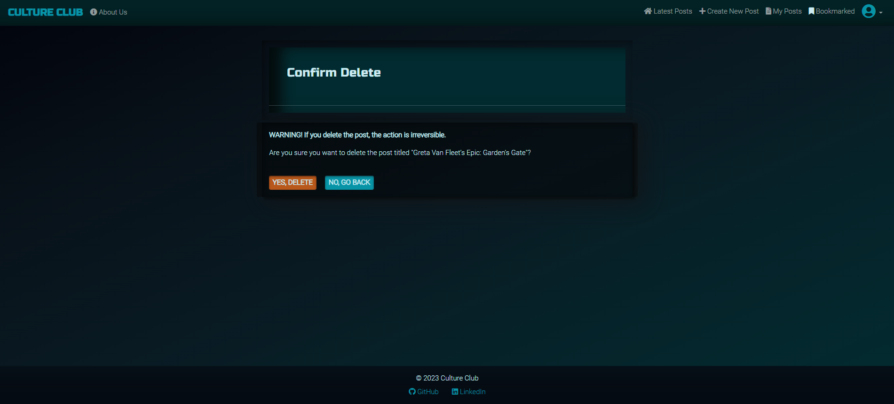
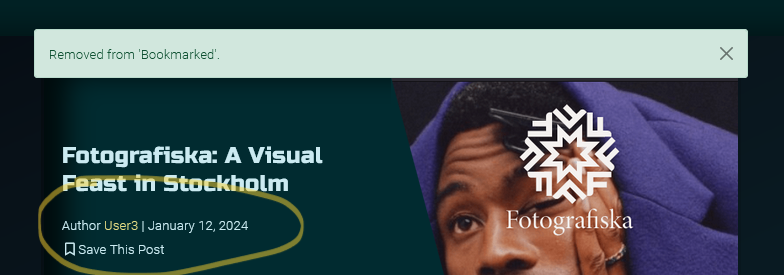
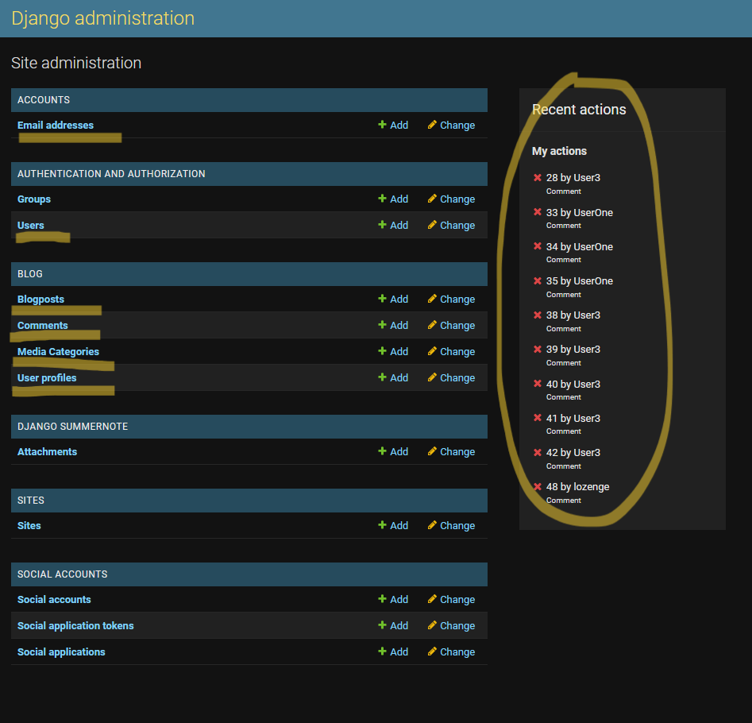

# Culture Club Testing 

Developer: [Debbie Bergström](https://github.com/DebbieBergstrom)  
[Live webpage](https://WEBADDRESS) 
[Project Repository](https://github.com/DebbieBergstrom/Culture-Club) 

## Table of Content

- [Code Validation](#code-validation)
  * [HTML Validation](#html-validation)
  * [CSS Validation](#css-validation)
  * [Python Validaton](#python-validaton)
- [Accessibility](#accessibility)
  * [**Wave**](#--wave--)
- [Performance](#performance)
  * [Desktop Performance](#desktop-performance)
  * [Mobile Performance](#mobile-performance)
- [Performing tests on various devices](#performing-tests-on-various-devices)
- [Browser compatibility](#browser-compatibility)
- [Automated Testing](#automated-testing)
  * [test_views.py](#test-viewspy)
  * [test_models.py](#test-modelspy)
  * [test_urls.py](#test-urlspy)
- [Manual Testing](#manual-testing)
  * [Security Testing](#security-testing)
  * [Testing user stories](#testing-user-stories)
  * [User Experience and Improvements](#user-experience-and-improvements)
  * [Full Testing](#full-testing)
- [Summary](#summary)
  * [HTML Validation](#html-validation-1)
  * [CSS Validation](#css-validation-1)
  * [Accessibility](#accessibility-1)
  * [Performance](#performance-1)
  * [User Experience](#user-experience)
  * [Automated Testing](#automated-testing-1)
  * [User Stories](#user-stories)
  * [Overall Status](#overall-status)

<small><i><a href='http://ecotrust-canada.github.io/markdown-toc/'>Table of contents generated with markdown-toc</a></i></small>

  

## Code Validation

### HTML Validation
[W3C Markup Validation](https://validator.w3.org/), provided by the World Wide Web Consortium (W3C), is a tool to check HTML code for adherence to web standards. It highlights syntax errors, incorrect tag use, and other issues that might affect the integrity and semantics of your web pages. Employing this validation service ensures your HTML is robust and aligns with web standards.

For validation, HTML pages were extracted from the web application's templates using the Google Chrome browser's 'Inspect' feature and then checked with W3C Validator.

This project incorporates "Summernote," a rich text editor, to facilitate user-generated HTML content for creating and updating posts. While Summernote enriches user interaction, it adds complexity to HTML code validation.

The flexibility afforded by Summernote in HTML content creation can result in non-standard HTML structures or attributes. These atypical elements are often flagged as errors in external validation tools like W3C Validator.

To balance the functionality of Summernote with application security, specific precautions are taken. For instance, the |safe filter in Django forms is used to prevent user-entered HTML from posing security risks to the application, safeguarding against potential threats and attacks.

| **Tested** | **Result** | **View Result** | **Pass** |
--- | --- | --- | :---:
|login.html| No errors | 

Screenshot of result

| ✅
|about_us.html| No errors | 

Screenshot of result

| ✅
|signup.html| No errors | 

Screenshot of result

| ✅
|index.html| No errors | 

Screenshot of result

| ✅
|blogpost_detail.html| No errors | 

Screenshot of result

| ✅
|blogpost_create.html| No errors | 

Screenshot of result

| ✅
|blogpost_update.html| No errors | 

Screenshot of result

| ✅
|blogpost_delete.html| No errors | 

Screenshot of result

| ✅
|profile.html| No errors | 

Screenshot of result

| ✅
|profile_edit.html| No errors | 

Screenshot of result

| ✅
|account_manage.html| No errors | 

Screenshot of result

| ✅
|my_posts.html| No errors | 

Screenshot of result

| ✅
|bookmarked.html| No errors | 

Screenshot of result

| ✅
|logout.html| No errors | 

Screenshot of result

| ✅

### CSS Validation
[W3C Jigsaw](https://jigsaw.w3.org/css-validator/) is a tool provided by W3C that allows you to validate and check the correctness of your CSS code. It helps ensure that your web pages comply with the standards set by the W3C, promoting interoperability and accessibility.

| **Tested** | **Result** | **View Result** | **Pass** |
--- | --- | --- | :---:
|CSS file | No errors |

Screenshot of result

| ✅

### Python Validaton 
[PEP 8](https://pep8ci.herokuapp.com/) serves as a comprehensive style guide for writing Python code, emphasizing consistency and readability as its core principles. It offers guidance on code formatting, variable and function naming conventions, and various best practices. Adhering to PEP 8 principles contributes to enhancing code quality, making it more readable and maintainable.

| **Tested** | **Result** | **View Result** | **Pass** |
--- | --- | --- | :---:
| culture_club/settings.py | All clear, no errors found | 

Screenshot of result

 | ✅ |
| culture_club/urls.py | All clear, no errors found | 

Screenshot of result

 | ✅ |
| blog/models.py | All clear, no errors found | 

Screenshot of result

 | ✅ |
| blog/views.py | All clear, no errors found | 

Screenshot of result

 | ✅ |
| blog/forms.py | All clear, no errors found | 

Screenshot of result

 | ✅ |
| blog/urls.py | All clear, no errors found | 

Screenshot of result

 | ✅ |
| blog/admin.py | All clear, no errors found | 

Screenshot of result

 | ✅ |
| blog/tests/test_views.py | All clear, no errors found | 

Screenshot of result

 | ✅ |
| blog/tests/test_models.py | All clear, no errors found | 

Screenshot of result

 | ✅ |
| blog/tests/test_urls.py | All clear, no errors found | 

Screenshot of result

 | ✅ |

(<a href="#table-of-content">back to top</a>)

  

## Accessibility

### **Wave**

[The WAVE Web Accessibility Evaluation Tool](https://wave.webaim.org/) was used to assess the accessibility of the website. WAVE helps identify potential accessibility issues and provides guidance on how to improve the accessibility of web content.

During the evaluation, the following issue was identified:

- **Contrast Warning**: The primary button's color scheme triggered a contrast warning during accessibility evaluation. However, upon thorough review and considering the overall aesthetic and user experience of the site, it has been determined that the current contrast level is sufficient. This decision was made with a careful balance between design integrity and usability in mind, ensuring that the button remains visually distinctive and functionally accessible for most users.

| Page | Accessibility Check | Screenshot | Status |
| ---- | ------------------- | ---------- | ------ |
| About Us | no errors found | 

Screenshot of result

 | ✅  |
| Create New Post | no errors found | 

Screenshot of result

 | ✅ |
| Edit Profile | no errors found | 

Screenshot of result

 | ✅ |
| Latest Posts | no errors found | 

Screenshot of result

 | ✅ |
| Log Out | no errors found | 

Screenshot of result

 | ✅ |
| Login Landing Page | no errors found | 

Screenshot of result

 | ✅ |
| Manage Account | no errors found | 

Screenshot of result

 | ✅ |
| Sign Up | no errors found | 

Screenshot of result

 | ✅ |
| User Profile | no errors found | 

Screenshot of result

 | ✅ |

(<a href="#table-of-content">back to top</a>)

  

## Performance
I conducted a comprehensive evaluation of [The culture club website](https://) using [Google Lighthouse in Google Chrome Developer Tools](https://developer.chrome.com/docs/lighthouse/). This evaluation was performed in Google Chrome browser's incognito mode to eliminate all potential impacts from other addons and cached files.

Several pages, including index.html, post_detail.html that contain larger amount of images, are impacted in performance scores due to our reliance on Cloudinary for image hosting and management. Cloudinary allows users to upload images, providing a dynamic and user-driven experience. However, this flexibility comes with certain trade-offs that affect the Lighthouse performance metrics:

Next-Gen Formats: Cloudinary serves images in formats that may not be the latest 'next-gen' formats recommended by Lighthouse, like WebP, due to broader compatibility considerations.

Image Sizing: Users can upload images of various dimensions, which may not always match the size in which they are displayed, leading to Lighthouse flagging issues with properly sizing images.

Encoding: The encoding settings on Cloudinary are optimized for a balance between quality and performance. While this works well in most cases, Lighthouse may suggest further optimizations that could reduce image fidelity.

Render-Blocking Resources: Some Cloudinary resources are loaded synchronously, which can be flagged by Lighthouse as render-blocking, but are necessary for displaying user content as intended.

These items stem from the inherent trade-offs between user control and automated optimization. While some improvements can be made, such as using Cloudinary's automatic format selection and responsive image capabilities, the nature of user-generated content means that perfect scores in these areas are challenging to achieve without compromising on the user experience.

The performance scores were assessed for both desktop and mobile devices. Below are the summarized results:

### Desktop Performance

- The average performance score across all the desktop pages assessed in the Lighthouse performance tests is approximately 90.07 out of 100.

| **Tested** | **Performance Score** | **View Result** | **Pass** |
--- | --- | --- | :---:
|login.html| 97 / 100 | 

Screenshot of result

 | ✅
|about.html| 98 / 100 | 

Screenshot of result

 | ✅
|signup.html | 97 / 100 | 

Screenshot of result

 | ✅
|index.html| 75 / 100 | 

Screenshot of result

 | ✅
|blogpost_detail.html| 82 / 100 | 

Screenshot of result

 | ✅
|blogpost_create.html| 84 / 100 | 

Screenshot of result

 | ✅
|blogpost_delete.html| 92 / 100 | 

Screenshot of result

 | ✅
|blogpost_update.html| 89 / 100 | 

Screenshot of result

 | ✅
|my_posts.html| 87 / 100| 

Screenshot of result

 | ✅
|bookmarked.html| 92 / 100| 

Screenshot of result

 | ✅
|profile.html|  / 89 | 

Screenshot of result

 | ✅
|profile_edit.html| 91 / 100 | 

Screenshot of result

 | ✅
|account_manage.html| 94 / 100 | 

Screenshot of result

 | ✅
|logout.html| 94 / 100 | 

Screenshot of result

 | ✅

### Mobile Performance
- Average performance score on mobile i approximately 76.71 out of 100.
- The pages showed slightly lower performance compared to the desktop but still maintained a satisfactory score.

| **Tested** | **Performance** | **View Result** | **Pass** |
--- | --- | --- | :---:
| login.html | 79 / 100 | 

Screenshot of result

 | ✅ |
| about.html | 86 / 100 | 

Screenshot of result

 | ✅ |
| signup.html | 86 / 100 | 

Screenshot of result

 | ✅ |
| index.html | 68 / 100 | 

Screenshot of result

 | ✅ |
| blogpost_detail.html | 76 / 100 | 

Screenshot of result

 | ✅ |
| blogpost_create.html | 61 / 100 | 

Screenshot of result

 | ✅ |
| blogpost_delete.html | 78 / 100 | 

Screenshot of result

 | ✅ |
| blogpost_update.html | 64 / 100 | 

Screenshot of result

 | ✅ |
| my_posts.html | 74 / 100 | 

Screenshot of result

 | ✅ |
| bookmarked.html | 54 / 100 | 

Screenshot of result

 | ✅ |
| profile.html | 82 / 100 | 

Screenshot of result

 | ✅ |
| profile_edit.html | 87 / 100 | 

Screenshot of result

 | ✅ |
| account_manage.html | 88 / 100 | 

Screenshot of result

 | ✅ |
| logout.html | 91 / 100 | 

Screenshot of result

 | ✅ |

In terms of performance, the Culture Club website delivered medium to strong results, ensuring a seamless user experience on desktop, but slightly lower performance on mobile platforms.

(<a href="#table-of-content">back to top</a>)

  

## Performing tests on various devices
The website was tested on the following devices:

<ins>Mobile</ins>
1. Samsung s22 ultra 
2. iPhone X 
3. Samsung galaxy s22
4. iPhone 14 Pro max

<ins>Desktop</ins>
1. Samsung Galaxy Book 360
2. HP Elite book 830 g9
3. HP Victus gaming desktop

<ins>Monitors</ins>
1. 49-inch Samsung CHG9 ultra-wide
2. 27-inch Benq zowie XL2746S
3. 27-inch Dell ultrasharp U2723QE

In addition, the website was tested using the Google Chrome Developer Tools Device Toggling option for all available device options.

(<a href="#table-of-content">back to top</a>)

  

## Browser compatibility
The website was tested on the following:

<ins>Browsers</ins>
1. Microsoft Edge
2. Google Chrome 	
3. Mozilla Firefox 	
4. Safari

(<a href="#table-of-content">back to top</a>)

  

## Automated Testing

<!-- Automated testing was a critical phase conducted towards the end of the project to gain a deeper understanding of automated testing practices and to uncover any hidden bugs or errors that might have slipped through. This phase focused on testing the essential components and functionalities of the project, with a particular emphasis on the CRUD (Create, Read, Update, Delete) operations and various URL patterns and view paths.

If more time was existing in this project, I would also create tests for all user stories.

I created a folder called "tests" inside of my blog application.
In this folder I created three separate files, each corresponding to a specific aspect of the project that needed testing. 
For conducting the tests, I leveraged Django's built-in testing framework and used the `django.test.TestCase` class as the foundation. This framework provides a robust and standardized environment for writing and executing tests, making it easier to assess the project's functionality and reliability.

Before the testing process, it was needed to configure the project's settings in the "settings.py" file in order for the automated testing to work properly. I added this two condition, 1 variable and 1 import statement. This was removed from settings.py when uploading the project to production in heroku for keeping the production settings separate from testing settings. -->

- `import sys`
- `TEST_APPS = ['blog.tests']` 
- `if 'test' in sys.argv or 'test_coverage' in sys.argv:
    DATABASES = {
        'default': {
            'ENGINE': 'django.db.backends.sqlite3',
            'NAME': BASE_DIR / 'db.sqlite3',
        }
    }
else:
    DATABASES = {
        'default': dj_database_url.parse(
            os.environ.get('DATABASE_URL')
        )
    }`

&nbsp;

- ### test_views.py
  See first test in image below.

- ### test_models.py
  See second test in image below.

- ### test_urls.py
  See third test in image below.

To measure code coverage and assess how much of the project's codebase is tested, I used the Coverage.py tool. Here are the steps to view the coverage report in HTML format:

Installing the Coverage.py using pip
- `Pip install coverage`

To check coverage in the HTML format run in the terminal:

- `coverage run --source='.' manage.py test`
  - This will create a `.coverage` file in your root directory
- `coverage html`
  - This will create a folder in your root directory called `htmlcov`
  - Right-click on it and select "Open with Live Server" to view the detailed coverage report.

My tests have achieved 97% code coverage.

  

(<a href="#table-of-content">back to top</a>)

  

## Manual Testing
&nbsp;
### Security Testing

Ensuring that users cannot access or modify other users' data is crucial for maintaining the integrity and security of the application. The table demonstrates the application's robustness in handling unauthorized access attempts, ensuring user data security and integrity.

The following tests were conducted to verify that unauthorized access attempts are properly handled.

| Test Case | Description | Method | Expected Outcome | Actual Outcome | Pass/Fail |
| --------- | ----------- | ------ | ---------------- | -------------- | --------- |
| Logout Redirection | Accessing another user's logout URL | Manual URL manipulation | Redirect to own user's logout page | Redirected correctly | ✅ |
| My Posts Redirection | Accessing another user's 'My Posts' URL | Manual URL manipulation | Redirect to own user's 'My Posts' page | Redirected correctly | ✅ |
| Edit Post Unauthorized Access | Attempting to edit another user's post | Manual URL manipulation | Receive a 404 error message | 404 error displayed | ✅ |
| Delete Post Unauthorized Access | Attempting to delete another user's post | Manual URL manipulation | Receive a 404 error message | 404 error displayed | ✅ |
| Bookmarked Posts Redirection | Accessing another user's bookmarked posts URL | Manual URL manipulation | Redirect to own user's 'Bookmarked' page | Redirected correctly | ✅ |
| Profile Redirection | Accessing another user's profile URL | Manual URL manipulation | Redirect to own user's profile page | Redirected correctly | ✅ |
| Edit Profile Unauthorized Access | Attempting to edit another user's profile | Manual URL manipulation | Redirect to own user's edit profile page | Redirected correctly | ✅ |
| Manage Account Unauthorized Access | Attempting to access another user's manage account/delete account page | Manual URL manipulation | Redirect to own user's manage account page | Redirected correctly; deletion affects the right user | ✅ |

&nbsp;
### Testing user stories

**Epic 1: User Authentication & Profile Management**

| User Goals | How this was achieved | Screenshot |
| --- | --- | --- |
| [User Account Registration (MUST HAVE)](https://github.com/DebbieBergstrom/Culture-Club/issues/2) | Implemented a user registration system allowing visitors to create new accounts. | 

Screenshot of result

 |
| [Log In and Out of User Account (MUST HAVE)](https://github.com/DebbieBergstrom/Culture-Club/issues/3) | Provided login and logout functionalities for user accounts. Log out option is in the user profile dropdown menu in the right corner | 

Screenshot of result

 

Screenshot of result

 |
| [Create, Update & Delete User Profile (MUST HAVE)](https://github.com/DebbieBergstrom/Culture-Club/issues/4) | In 'Profile Edit' users can update their information and upload a profile picture, no image = a placeholder shows. Delete account is under 'Manage Account' | 

Screenshot of result

 

Screenshot of result

 |
| [Favorite Lists in Personal Bio (COULD HAVE)](https://github.com/DebbieBergstrom/Culture-Club/issues/5) | Users can list their favorite movies, books, etc., in their profile. | 

Screenshot of result

 |
| [Password Reset (WON'T HAVE)](https://github.com/DebbieBergstrom/Culture-Club/issues/43) | A password reset feature was not implemented in this phase, but site admin has the power to change password for a user in the admin panel. | No result image |

&nbsp;
**Epic 2: Blog Interaction & Content Management**

| User Goals | How this was achieved | Screenshot |
| --- | --- | --- |
| [User Create, Edit & Delete Blog Posts (MUST HAVE)](https://github.com/DebbieBergstrom/Culture-Club/issues/7) | Users can create, edit and delete their own blog posts using a rich text editor. | 

Screenshot of result

 

Screenshot of result

 

Screenshot of result

 |
| [Comment Blog Posts (MUST HAVE)](https://github.com/DebbieBergstrom/Culture-Club/issues/8) | Users can comment on blog posts. | 

Screenshot of result

 

Screenshot of result

 |
| [Like/Unlike Blog Posts (SHOULD HAVE)](https://github.com/DebbieBergstrom/Culture-Club/issues/9) | Users can express their appreciation for a post by liking or un-liking it. Confirmation through full colored heart when liked otherwise just outlined heart | 

Screenshot of result

 

Screenshot of result

 |
| [View Other Users' Profiles (SHOULD HAVE)](https://github.com/DebbieBergstrom/Culture-Club/issues/10) | Users can view the profiles of other users and see their top selections. Other users profile does not contain the links to 'Edit Profile' or 'Manage Account' as the users own profile does | 

Screenshot of result

 

Screenshot of result

 |
| [See Post Overview (SHOULD HAVE)](https://github.com/DebbieBergstrom/Culture-Club/issues/11) | Users can view an overview of the latest posts and a short excerpt before deciding to read the full content. | 

Screenshot of result

 |
| [Read Full Post Detail (MUST HAVE)](https://github.com/DebbieBergstrom/Culture-Club/issues/12) | Users can read the full details of a blog post, including comments and interactions. | 

Screenshot of result

 |
| [Bookmark Blog Posts (COULD HAVE)](https://github.com/DebbieBergstrom/Culture-Club/issues/29) | Users can bookmark their favorite blog posts for quick access in 'Bookmarked' section and remove bookmark too. Confirmation through full colored bookmark symbol when clicked otherwise just outlined symbol. Validation message also appear. | 

Screenshot of result

 

Screenshot of result

 |
| [Follow Other Users (WON'T HAVE)](https://github.com/DebbieBergstrom/Culture-Club/issues/30) | The functionality to follow other users was not implemented in this phase. | No result image |

&nbsp;
**Epic 3: Administration & Analytics**

| Site Owner Goals | How this was achieved | Screenshot |
| --- | --- | --- |
| [Admin - Full Control Over User Accounts (MUST HAVE)](https://github.com/DebbieBergstrom/Culture-Club/issues/13) | Site owners or admin users have access to an admin dashboard where they can have complete control over user accounts, including management and oversight. | 

Screenshot of result

 |
| [Admin - Review and Edit User-Submitted Blog Posts and comments (SHOULD HAVE)](https://github.com/DebbieBergstrom/Culture-Club/issues/14) | Admins can review, approve, or edit user-submitted blog posts and comments. | 

Screenshot of result

 

Screenshot of result

 |
| [Admin - Manage and Categorize Blog Posts (COULD HAVE)](https://github.com/DebbieBergstrom/Culture-Club/issues/15) | Admins can manage the categorization of blog posts for better organization and user experience. | 

Screenshot of result

 |
| [Admin - Track User Engagement and Analytics (WON'T HAVE)](https://github.com/DebbieBergstrom/Culture-Club/issues/16) | This feature for tracking analytics was not implemented in the current phase. | No result image |

&nbsp;
**Epic 4: User Experience & Accessibility**

| User Goals | How this was achieved | Screenshot |
| --- | --- | --- |
| [Visually Appealing Landing Page (SHOULD HAVE)](https://github.com/DebbieBergstrom/Culture-Club/issues/17) | Designed an engaging and visually appealing landing page to attract and retain users. | 

Screenshot of result

 |
| [Navigate to About Us (SHOULD HAVE)](https://github.com/DebbieBergstrom/Culture-Club/issues/18) | Included clear navigation to the 'About Us' section to inform users about the website. Can always be seen in the navbar to the right or the collapsed menu in smaller screens | 

Screenshot of result

 |
| [Navigate to Join the Club Section (MUST HAVE)](https://github.com/DebbieBergstrom/Culture-Club/issues/19) | Implemented easy navigation to the 'Join the Club' section to encourage user registration. Can be seen in the navbar to the right or the collapsed menu in smaller screens. The link is visible only when no user is logged in. | 

Screenshot of result

 |
| [Easy Login from Landing Page (MUST HAVE)](https://github.com/DebbieBergstrom/Culture-Club/issues/20) | Integrated a straightforward login mechanism directly from the landing page for fast and easy access. | 

Screenshot of result

 |
| [Navigate through a well-designed website (MUST HAVE)](https://github.com/DebbieBergstrom/Culture-Club/issues/33) | The website's design emphasizes intuitive navigation and user-friendly interfaces. Buttons are colorful and easy to see and hyperlinks are yellow and for example they show where the user could navigate to other users profile. The more User Profile specific links for the logged in user are gathered in the dropdown menu to the right. | 

Screenshot of result

 

Screenshot of result

 |
| [Site pagination for easy navigation (SHOULD HAVE)](https://github.com/DebbieBergstrom/Culture-Club/issues/32) | Implemented pagination for easy browsing of blog posts. | 

Screenshot of result

 

Screenshot of result

 |

&nbsp;

### User Experience and Improvements
I engaged in user testing involving friends and family and I requested them to complete the following tasks and share their feedback on their overall experience:

Total users attended the testing: 5

| Test                   | Result  |
|------------------------|---------|
| Create an account      | **100%**|
| Update the profile     | **100%**|
| Add a blog post        | **100%**|
| Edit a post            | **100%**|
| Like a post            | **100%**|
| Unlike a post          | **100%**|
| Comment on a post      | **100%**|
| Bookmark a post        | **100%**|
| Un-bookmark a post     | **100%**|
| Delete a post          | **100%**|
| Test links             | **100%**|
| Delete account         | **100%**|

&nbsp;

**Feedback from testers**

Provided feedback and reported any issues or improvements they encountered during the testing process. Below is the feedback/issues reported.

Certainly! Here's a table with the columns you requested:

| Feature | Feedback | Solution | Result | Fixed |
| --- | --- | --- | --- | --- |
| 'Music Albums' category button | Button is not targeted with the css that makes it darker and looked pressed down when active. | This seems to be because of the space between the two words in the category. Therefore a '+' between the words in the html template and <active"> had to be implemented to fix the issue. | The button works as it should, changing color to a darker shade when active. | ✅ |
| Summernote blog content editor | The text container is not responsive an leaks out to the right of the container on screens smaller than large.| Summernote seems to have a default fixed with. Feedback was given with a known solution on how to change the fixed width with some additional code in settings.py: SUMMERNOTE_CONFIG = {"summernote": {"width": "100%",},} | The text field container is now responsive to smaller screens | ✅ |
| User Profile fields | If, by any chance, the user chooses to have a username that is unusually long (no white spaces), the username will overflow its container and be displayed out to the right. Same happens to the fields below. | After trying many options to target the field with text-wrap css class and limit characters with failure, and considering making big changes to the models, I came to the conclusion that it is in this stage not prioritized. If the fields contain white spaces (which it does after every word), the line breaks and the content looks nice in the user profiles. The unlikelihood of a user choosing to have a user name that causes this issue is why this is going to have to be considered working on in a later stage. | The text will overflow, but has been removed by admin | ❌ |

&nbsp;

### Full Testing

**`Navbar links, unauthorized/ not logged in user`**

| Feature | Expected Outcome | Testing Performed | Result | Pass/Fail |
| --- | --- | --- | --- | --- |
| Logo | Redirects to landing page login.html | Clicked on logo | Landing page loads | ✅ |
| About Us | Redirects to the 'About Us' page with the 'Join the Club' button visible | Clicked on the link 'About Us' | 'About Us' page loads and shows the 'Join the Club' button | ✅ |
| Join the Club | Redirects to the sign up page and form with a 'Sign Up' button | Clicked on the link 'Join the Club' | Sign-up page loads and the form displays with a 'Sign Up' button | ✅ |

&nbsp;

**`About Us page, unauthorized/ not logged in user`**

| Feature | Expected Outcome | Testing Performed | Result | Pass/Fail |
| --- | --- | --- | --- | --- |
| "Join the club" button | Redirects to the sign up page and form with a 'Sign Up' button | Clicked on the link 'Join the Club' | Sign-up page loads and the form displays with a 'Sign Up' button | ✅ |

&nbsp;

**`Sign up page, unauthorized/ not logged in user`**

| Feature | Expected Outcome | Testing Performed | Result | Pass/Fail |
| --- | --- | --- | --- | --- |
| Username input | Field is required and should be a valid username format | Tested with an empty field, invalid format | Error message is displayed prompting the user to provide a valid username | ✅ |
| Email input | Field is optional but should be a valid email format if entered | Tested with an empty field and invalid format | Sign up can be successful without email address. Error message displayed prompting the user to provide a valid email address if user type in the field | ✅ |
| Password input | Field is required and should meet password criteria | Tested with an empty field, invalid criteria | Error message displayed prompting the user to provide a valid password | ✅ |
| Password confirmation input | Field is required and should match the entered password | Tested with empty field, mismatched passwords | Error message displayed prompting the user to confirm the password correctly | ✅ |
| "Sign up" button | If the form is valid, the user is redirected to the blog post overview (index.html) page with a message confirming successful registration. If the form is not valid, an error message is displayed. | Clicked the button with valid and non-valid formats | The button functions as expected, redirecting to the appropriate page and displaying the corresponding messages | ✅ |
| "Login" text link | Redirects to the login page | Clicked on the "Login" link | The login page and form were successfully loaded | ✅ |
| "About Us" text link | Redirects to the 'About Us' page | Clicked on the 'About Us' link | The 'About Us' page and form were successfully loaded | ✅ |

&nbsp;

**`Landing page with login form, unauthorized/ not logged in user`**

| Feature | Expected Outcome | Testing Performed | Result | Pass/Fail |
| --- | --- | --- | --- | --- |
| "Sign up" link on login form | Redirects to the 'Join the Club' page and form | Clicked on "Sign Up" link | Sign-up page loads, displaying the editable form with a 'Sign Up' button | ✅ |
| Username input | The user enters a username | Tested with valid and invalid username input | The username field accepts and saves the valid input. If invalid, it displays an error message | ✅ |
| Password input | The user enters a password | Tested with valid and invalid password input | The password field functions correctly, allowing the user to input a valid password and displays an error message when not valid | ✅ |
| "Login" button | If the login form is valid, the user is logged in and redirected to the index.html page. If the form is not valid, an error message is displayed. | Tested with valid and invalid login form input | The login button functions correctly, logging in the user with valid credentials and displaying error messages for invalid credentials | ✅ |

&nbsp;

**`Navbar authorized/ logged in user`**

| Feature | Expected Outcome | Testing Performed | Result | Pass/Fail |
| --- | --- | --- | --- | --- |
| Logo | Redirects to index.html (blog posts) page | Clicked on logo | Index page loads | ✅ |
| Latests Posts | Redirect to index.html (blog posts) page | Clicked on the link 'Latest Posts' | Index.html page loads | ✅ |
| About Us | Redirects to the 'About Us' page with the 'Back to home' button visible | Clicked on the link 'About Us' | 'About Us' page loads and shows the 'Back to home' button | ✅ |
| Create new Post | Redirects to the 'Create new Post' page with the 'Create Post' button visible | Clicked on the link 'Create new Post' | 'Create new Post' page loads and shows the 'Create Post' button | ✅ |
| Profile icon | Triggers the dropdown menu | Clicked on the icon | The dropdown menu is displayed | ✅ |
| My Posts | Redirects to the page displaying the user's created posts | Clicked on the "My Posts" link | "My Posts" page loads, showing the user's created blog posts | ✅ |
| Bookmarked | Redirects to the page displaying the user's bookmarked posts | Clicked on the "Bookmarked" link | "Bookmarked" page loads, showing the user's bookmarked blog posts | ✅ |

&nbsp;

**`About Us page, authorized/ logged in user`**

| Feature | Expected Outcome | Testing Performed | Result | Pass/Fail |
| --- | --- | --- | --- | --- |
| "Back to home" button | Redirect to index.html (blog posts) page | Clicked on the button 'Back to home' | Index.html page loads | ✅ |

&nbsp;

**`Profile drop-down menu, authorized/ logged in user`**

| Feature | Expected Outcome | Testing Performed | Result | Pass/Fail |
| --- | --- | --- | --- | --- |
| My Profile | Redirects to the user profile page with the user's information | Clicked on the "My Profile" link | Profile page loads, displaying the user's information | ✅ |
| Edit Profile | Redirects to the page displaying the user's own profile page | Clicked on the "Edit Profile" link | "Edit Profile" page loads, showing the user's profile page | ✅ |
| Manage Account | Redirects to the page where the user can choose to delete their account | Clicked on the "Manage Account" link | "Manage Account" page loads, displaying the warning about deleting the account and displays button "Delete Account" and "No Go Back" | ✅ |
| Logout | Redirects the user to a logout confirmation page | Clicked on "Logout" | User is redirected to a page confirming the logout | ✅ |

&nbsp;

**`Index page, authorized/ logged in user`**

| Feature | Expected Outcome | Testing Performed | Result | Pass/Fail |
| --- | --- | --- | --- | --- |
| "All" Category button | Redirects to the page displaying all blog posts | Clicked on the "All Category" button | Successfully redirected to the page displaying all blog posts | ✅ |
| "Movies/Series" button | Redirects to the page displaying all blog posts with the category "Movies/Series" | Clicked on the "Movies/Series" button | Successfully redirected to the page displaying blog posts with Movies/Series as the category | ✅ |
| "Music Albums" button | Redirects to the page displaying all blog posts with the category "Music Albums" | Clicked on the "Music Albums" button | Successfully redirected to the page displaying blog posts with Music Albums as the category | ✅ |
| "Books" button | Redirects to the page displaying all blog posts with the category "Books" | Clicked on the "Books" button | Successfully redirected to the page displaying blog posts with Books as the category | ✅ |
| "Podcasts" button | Redirects to the page displaying all blog posts with the category "Podcasts" | Clicked on the "Podcasts" button | Successfully redirected to the page displaying blog posts with Podcasts as the category | ✅ |
| "Misc" button | Redirects to the page displaying all blog posts with the category "Miscellaneous" | Clicked on the "Misc" button | Successfully redirected to the page displaying blog posts with Miscellaneous as the category | ✅ |
| Blog post card image link | Redirects to the blog post detail page | Clicked on the image link of a post | Successfully redirected to the blog post detail page | ✅ |
| Blog post card title link | Redirects to the blog post detail page | Clicked on the title link of a post | Successfully redirected to the blog post detail page | ✅ |
| Pagination | Displays pagination if more than 6 blog posts | Added more than 6 blog posts to the list | Pagination is displayed showing the correct number of pages | ✅ |
| Page buttons on pagination | Navigates to the correct page | Clicked on page number/next/previous buttons in pagination | Successfully navigated to the correct page based on the button clicked | ✅ |

&nbsp;

**`Profile page, authorized/ logged in user`**

| Feature | Expected Outcome | Testing Performed | Result | Pass/Fail |
| --- | --- | --- | --- | --- |
| "Edit Profile" link | Redirects to the page displaying the user's own profile page | Clicked on the "Edit Profile" link | "Edit Profile" page loads, showing the user's profile page | ✅ |
| Manage Account link | Redirects to the page where the user can choose to delete their account | Clicked on the "Manage Account" link | "Manage Account" page loads, displaying the warning about deleting the account and displays button "Delete Account" and "No Go Back" | ✅ |

&nbsp;

**`Edit/update profile page, authorized/ logged in user`**

| Feature | Expected Outcome | Testing Performed | Result | Pass/Fail |
| --- | --- | --- | --- | --- |
| "Edit Profile" | When changes are made and the "Save changes" button is clicked, the changes should be saved, the user should be redirected to the profile page, and a flash message should confirm the update | Made changes and click on the "Update" button | Changes were successfully saved, redirected to the profile page with the new information displayed, and a flash message confirmed the update | ✅ |

&nbsp;

**`Manage Account/ Delete profile page, authorized/ logged in user`**

| Feature | Expected Outcome | Testing Performed | Result | Pass/Fail |
| --- | --- | --- | --- | --- |
| "Delete Account" button | When the "Delete Account" button is clicked, the user should be prompted with another extra confirmation button. If confirmed deletion user is deleted and redirected to the login page. | Clicked on the "Delete" button and confirmed the onclick popup confirm button again | Redirected to the login page with no access to the account or user | ✅ |
| "No, go back" button | Redirects to the profile page | Clicked on the "No, go Back" button | The profile page loads, displaying the profile information | ✅ |

&nbsp;

**`My Posts page, authorized/ logged in user`**

| Feature | Expected Outcome | Testing Performed | Result | Pass/Fail |
| --- | --- | --- | --- | --- |
| "Edit Profile" button | Redirects to the Profile Edit page | Clicked on the "Edit Profile" button | Successfully redirected to the Profile Edit page where the user can make changes to their profile | ✅ |
| "Delete Post" button | Redirects to the Delete Post page for the specific post | Clicked on the "Delete Post" button for a specific post | Successfully redirected to the Delete Post page where the user can confirm the deletion of the post | ✅ |

&nbsp;

**`Bookmarked page, authorized/ logged in user`**

| Feature | Expected Outcome | Testing Performed | Result | Pass/Fail |
| --- | --- | --- | --- | --- |
| Post title hyperlink | Redirects to the detailed view of the blog post | Clicked on the post title link | Successfully redirected to the blog post detail page | ✅ |
| Author hyperlink | Redirects to the author's user profile page | Clicked on the author's link | Successfully redirected to the author's profile page, displaying their information and posts | ✅ |
| "Read more" button | Redirects to the detailed view of the blog post | Clicked on the "Read more" button | Successfully redirected to the blog post detail page for further reading | ✅ |

This table highlights the key features of the "Bookmarked" page, demonstrating how users can easily navigate to a detailed view of a bookmarked blog post or to the profile of the post's author.

&nbsp;

**`Blog Post Detail page, authorized/ logged in user`**

| Feature | Expected Outcome | Testing Performed | Result | Pass/Fail |
| --- | --- | --- | --- | --- |
| Author link to User | Redirects to the author's user profile page | Clicked on the author link | Successfully redirected to the author's profile page | ✅ |
| "Save the post" bookmark icon | Toggles between bookmarked and un-bookmarked state. Displays color-filled heart when bookmarked and outlined heart when not | Clicked the bookmark icon to bookmark and un-bookmark | Successfully toggled between bookmarked and un-bookmarked states with corresponding "bookmark" icon and success messages | ✅ |
| "Like" heart icon | Toggles between liked and unliked state. Displays color-filled heart when liked and outlined heart when not. Count of likes changes accordingly | Clicked the like icon to like and unlike the post | Successfully toggled between liked and unliked states with corresponding heart icons and the like count updated | ✅ |
| Comment section | Allows user to write a comment | Wrote a comment in the comment section | Successfully wrote and displayed the comment | ✅ |
| "Submit button" in Comment section | Posts the comment to the blog post and displays it in the comments section | Clicked the submit button after writing a comment | Successfully posted the comment to the blog post and displayed it in the comments section | ✅ |

&nbsp;

**`Create New Post page, authorized/ logged in user`**

| Feature | Expected Outcome | Testing Performed | Result | Pass/Fail |
| --- | --- | --- | --- | --- |
| "Create Post" button | Upon filling in the required fields and clicking "Create Post", the new blog post should be saved and the user should be redirected to the blog post detail page | Filled in required fields and clicked on the "Create Post" button | Successfully created a new post, redirected to the blog post detail page, and displayed the newly created post | ✅ |
| Title input field (required) | Must enter a title to create a post | Entered a title for the blog post | Successfully accepted the title input | ✅ |
| Excerpt input field | Optional field for providing a brief summary of the post | Entered an excerpt for the blog post | Successfully accepted the excerpt input | ✅ |
| Content input field (required) | Must enter content to create a post | Entered content for the blog post | Successfully accepted the content input | ✅ |
| Image upload (optional) | Allows uploading an image for the blog post, uses a placeholder if no image is uploaded | Uploaded an image for the blog post | Successfully displayed the uploaded image (or placeholder if none) | ✅ |
| Year of Release input (required) | Validates input and requires a year of release for the post | Entered a year of release for the blog post | Successfully validated and accepted the year of release input | ✅ |
| Media Link input (required) | Validates that the input is a link and is required for the post | Entered a media link for the blog post | Successfully validated and accepted the media link input | ✅ |
| Media Category selection (required) | Requires selecting a media category from the list | Selected a media category for the blog post | Successfully required and accepted the selection of a media category | ✅ |

&nbsp;

**`Update post page, authorized/ logged in user`**

| Feature | Expected Outcome | Testing Performed | Result | Pass/Fail |
| --- | --- | --- | --- | --- |
| "Save Changes" button | When changes are made and the "Save Changes" button is clicked, the changes should be saved, the user should be redirected to the blog post detail page, and a flash message should confirm the update | Made changes and click on the "Save Changes" button | Changes were successfully saved, redirected to the blog post detail page, and a flash message confirmed the update | ✅ |

&nbsp;

**`Delete post page, authorized/ logged in user`**

| Feature | Expected Outcome | Testing Performed | Result | Pass/Fail |
| --- | --- | --- | --- | --- |
| "Yes, Delete" button | When the "Yes, Delete" button is clicked, the post is deleted, and the user is redirected to the "My Posts" page with a confirmation success message | Clicked on the "Delete Post" button | Successfully deleted the post, redirected to the "My Posts" page, and displayed a confirmation success message | ✅ |
| "No, go back" button | Redirects to the "My Posts" page | Clicked on the "No, go Back" button | Successfully redirected to the "My Posts" page, displaying the user's posts | ✅ |

&nbsp;

**`Footer, all pages`**

| Feature | Expected Outcome | Testing Performed | Result | Pass/Fail |
| --- | --- | --- | --- | --- |
| LinkedIn link | Redirects to the specified LinkedIn profile | Clicked on the LinkedIn icon/link | Successfully redirected to the LinkedIn profile | ✅ |
| GitHub link | Redirects to the specified GitHub profile | Clicked on the GitHub icon/link | Successfully redirected to the GitHub profile | ✅ |

&nbsp;

**`403, 404, 405, 500 Page`**

| Feature | Expected Outcome | Testing Performed | Result | Pass/Fail |
| --- | --- | --- | --- | --- |
| "Return home" button | Correct "error message" displays and redirects the user to index.html page where the articles are | Edited a non-URL path in the web browser and then clicked on the "Return home" button | Correct error handling message was displayed for the user, and when the "Return home"  button was clicked, the user was redirected to the index page where posts are displayed | ✅ |

(<a href="#table-of-content">back to top</a>)

  

## Summary

Testing The Culture Club web application, conducted a comprehensive evaluation of various aspects, including HTML validation, CSS validation, accessibility, performance, and user experience. The following summarizes our key findings and the status of our testing:

### HTML Validation

- HTML validation tests were successful.

### CSS Validation

- CSS code was free from errors, ensuring compliance with web standards and promoting consistent design and layout.

### Accessibility

- The WAVE Web Accessibility Evaluation Tool helped identify potential accessibility issues like contrast warnings. They were taken into consideration, but were assessed as not being a problem in this projects design.

### Performance

- Performance tests yielded medium to strong results, indicating good performance on both desktop and mobile devices. Some known errors related to image optimization were identified but could not be resolved due to external dependencies.

### User Experience

- Engaged in user testing with various scenarios and received positive feedback from testers, addressing any issues they encountered.

### Automated Testing

- Automated testing using Django's testing framework, covered essential components, CRUD functionalities, and URL patterns. Automated tests passed successfully, ensuring the reliability of critical features.

### User Stories

- Tested a wide range of user stories and scenarios, ensuring that users can easily navigate, interact with, and enjoy the website's features.

### Overall Status

This project Culture Club is in good shape, with features functioning as expected. 

(<a href="#table-of-content">back to top</a>)

  

